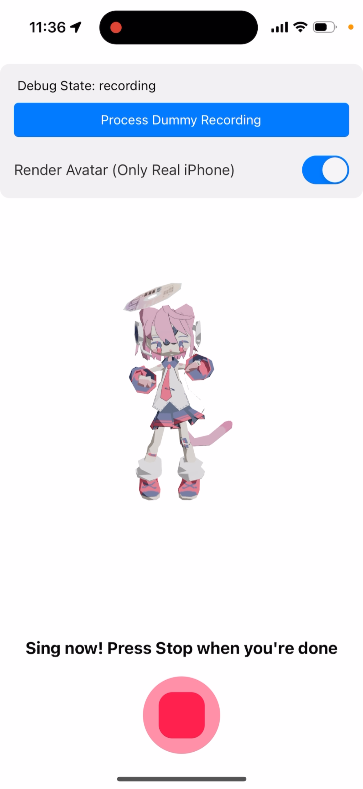
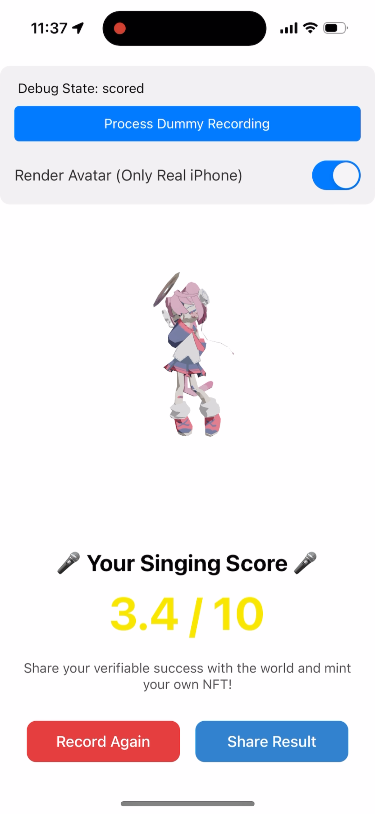
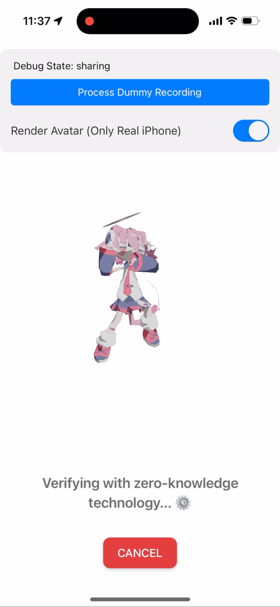

# CryptoIdol React Native Application

**Note**: This application is written in React Native but currently only supports **iOS** devices. Due to limitations
with the EZKL library, **Android is not supported** at this time.

This is the **React Native** port of the website [cryptoidol.tech](https://cryptoidol.tech), designed to run on **iOS
17.5** and higher. The application leverages the power of on-device machine learning to assess users' singing skills and
allows them to mint a unique NFT based on their performance (coming soon).

**Recommended Device**: The app is optimized for **iPhone 15 Pro** or higher due to memory-intensive processes (RAM
usage: 2GB).

## Features

### 1. Record Your Singing 🎤

With the CryptoIdol app, you can record your singing directly through your iPhone. The app captures and processes the
recording locally, ensuring privacy and efficiency. This is the core functionality of the app, providing a user-friendly
interface to showcase your talent.



### 2. Local Scoring with Machine Learning 🧠

The app uses an on-device machine learning model to **evaluate the quality of your singing**. The scoring happens
entirely on your device, meaning your recording never leaves your phone, ensuring privacy. The score is based on factors
such as pitch, rhythm, and clarity, offering an objective measure of your performance.



### 3. Generate Cryptographic Proof of Your Score 🔐

Once you have your score, the app allows you to generate a **cryptographic proof**
using [EZKL iOS Bindings](https://github.com/zkonduit/ezkl-swift-package.git). This proof ensures that your score is
authentic and has not been tampered with. The proof generation is performed locally, providing transparency and trust in
your singing score.



### 4. Mint a Unique NFT 🎨

In future versions, the app will allow you to mint a **unique NFT** based on your singing score. This NFT will be
generated as a reward for your performance, creating a verifiable and unique asset representing your talent. The NFT
minting feature is currently in development and will be released in upcoming updates.

## Proof Generation and Integration Tutorial

In this project, the proof generation for Neural Network execution is based on
the [EZKL Swift Package](https://github.com/zkonduit/ezkl-swift-package.git), which is an iOS-compatible wrapper around
the EZKL library, managed by the Swift Package Manager (SPM). The following tutorial outlines the steps required to
integrate the EZKL package in a React Native application.

### Step 1: Model and SRS File Preparation

In this example, we include the following assets in the app bundle:

- **model.compiled**: A compiled ONNX model.
- **kzg16.srs**: The structured reference string (SRS) file for the proof system.

We save space by generating the proving key (PK) and verification key (VK) on the fly during app startup. Alternatively,
you can bundle precomputed PK and VK files in the app to avoid generating them dynamically, which can reduce the
computational load.

### Step 2: Adding EZKL Package to Xcode

Since React Native does not natively support SPM packages, only CocoaPods, we need to manually add the EZKL Swift
Package as a dependency in Xcode. Follow these steps:

1. Open your project in Xcode.
2. Go to **File > Add Packages…** and search for the EZKL Swift Package GitHub URL.
3. Add the EZKL package as a dependency to your project by following
   the [EZKL package instructions](https://github.com/zkonduit/ezkl-swift-package.git).

Ensure that the version of the EZKL Swift Package matches the EZKL CLI version you use locally for generating assets (
e.g., compiling the model) to maintain compatibility.

### Step 3: Exposing Swift Code to React Native

To make the EZKL functionality accessible from JavaScript in React Native, we need to expose Swift functions to React
Native by following [this tutorial](https://dev.to/akinncar/how-to-use-swift-in-your-react-native-app-46mj).

1. **Create Wrapper Files**:

- Implement the required Swift functions in a wrapper
  file, [`CryptoIdolModule.swift`](ios/CryptoIdol/CryptoIdolModule.swift), which provides methods to interact with the
  EZKL package, like proof generation.
- Bridge this Swift code to React Native by creating an Objective-C bridge
  file, [`CryptoIdolModuleBridge.m`](ios/CryptoIdol/CryptoIdolModuleBridge.m), that connects the Swift module with
  React Native.

2. **JavaScript Integration**:

- We set up the PK and VK keys during app startup in [`setupModelProver.js`](src/prover/setupModelProver.js). This
  code dynamically generates the keys and stores them in the file system.
- The proof is generated by calling the function in [`runModelProver.js`](src/prover/runModelProver.js), which
  interacts with the EZKL Swift Package. This script passes the PK and VK paths and the model input as a
  JSON-serialized string to the Swift module.

3. **Running Proof Generation on a Background Thread**:

- To avoid blocking the main JavaScript thread, we execute the Swift proof generation on a separate thread. This
  allows the app to remain responsive during computation-intensive tasks.

With this setup, the EZKL package is effectively integrated, and proof generation is performed with minimal impact on
the app's performance. This example demonstrates how to integrate and manage cryptographic proof generation within a
React Native project using Swift and SPM.

## Smart Contracts

The contracts are based on
the [cryptoidol-contracts](https://github.com/ElusAegis/cryptoidol-contracts/tree/feat/updated-model) code and are
currently deployed to the Sepolia test network at `0x6C686453CB666692c37D956F7696D5205378f3D3`. To run the demo, you
will need some Sepolia ETH, which you can obtain from
the [Google Cloud Sepolia Faucet](https://cloud.google.com/application/web3/faucet/ethereum/sepolia).

## Requirements

- **Mac with Xcode**: To build and deploy the app, you need a Mac with Xcode installed.
- **Node.js**: Install Node.js 20.0 or higher.
- **CocoaPods** [Install Cocoapods](https://cocoapods.org) for iOS package managment.
- **iOS Version**: 17.5 or higher
- **Recommended Device**: iPhone 15 Pro or higher (due to RAM requirements)
- **RAM Requirement**: 4GB+ for smooth processing of the machine learning model and proof generation
- **Simulator Support**: You can run the app in the simulator on a Mac instead of deploying to a real device. Due to
  hardware limitations of the [EZKL Swift Package](https://github.com/zkonduit/ezkl-swift-package.git), the simulation
  mode only works on **M chip series Macs**.

## Setup Instructions

1. **Clone the repository**:
   ```
   git clone https://github.com/zkonduit/cryptoidol-react-native.git
   ```
2. **Install dependencies**:
   ```
   npm install
   ```
   or
   ```
   yarn install
   ```
3. **Install iOS dependencies**:
   ```
   cd ios && pod install
   ```
4. **Start Development Server**:
   ```
   npx react-native start --reset-cache
   ```

  And press **i** for iPhone mode when prompted.


5. **Run the app**:

- **Simulator**: To run the app in the simulator on your Mac, execute:

  ```
  npx react-native run-ios --simulator="iPhone 15 Pro"
  ```

- **Real Device**: To run it on a real iPhone, make sure you have connected your device to your Mac via USB and execute:

  ```
  npx react-native run-ios
  ```

  Optionally, you can add `mode="Release"` to build a release version of the app, that does not require the development server running in order to use.

  **Note**: Running on a real device requires additional configuration in Xcode:

  - Connect your iPhone to your Mac via USB.
  - Open the project in Xcode (`ios` folder).
  - Select your device in the Xcode toolbar.
  - Go to **Signing & Capabilities** and select your **Development Team**.
  - Ensure that the **Bundle Identifier** is unique (you may need to change it).
  - On your iPhone, go to **Settings > General > Device Management** and trust your developer certificate.

## Notes

- **CryptoIdol Rendering**: The avatar (dancing girl) will only render on a physical device. It will not appear on
  simulators due to hardware constraints. Ensure you test on a real iPhone for full functionality.
- **Simulator Limitations**: Due to hardware limitations of
  the [EZKL Swift Package](https://github.com/zkonduit/ezkl-swift-package.git), the simulation mode only works on **M
  series Macs**.
